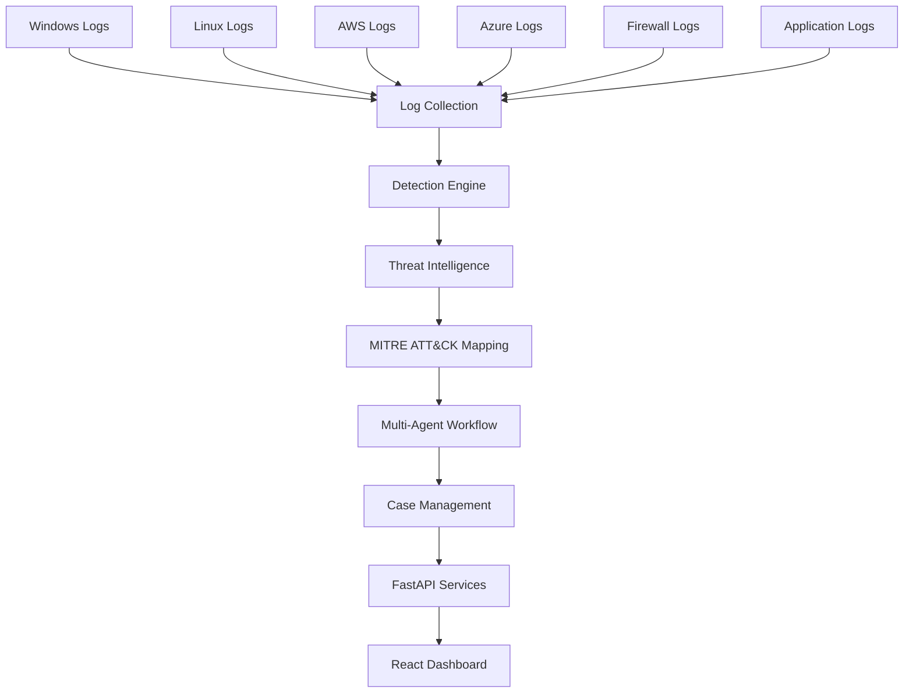
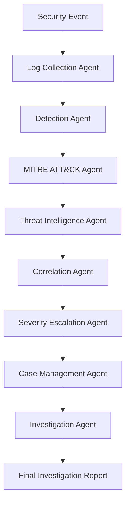

# Agentic AI Security Operations Platform

An Agentic AI-powered Security Operations Platform that automates security investigations through a coordinated multi-agent workflow. The platform combines threat detection, threat intelligence enrichment, MITRE ATT&CK mapping, case management, FastAPI services, and a React dashboard to help analysts investigate and prioritize security incidents.

The project demonstrates practical implementation of Agentic AI architectures, Model Context Protocol (MCP), Pydantic AI, multi-agent systems, and security automation within a modern Security Operations Center (SOC) environment.

---

## Key Features

### Agentic AI Investigation Workflow

Security incidents are processed through a coordinated multi-agent pipeline where each agent performs a specialized security function before passing context to the next stage.

Agents include:

* Log Collection Agent
* Detection Agent
* MITRE ATT&CK Agent
* Threat Intelligence Agent
* Correlation Agent
* Severity Escalation Agent
* Case Management Agent
* Investigation Agent

The workflow produces structured investigation outputs containing threat intelligence enrichment, MITRE ATT&CK mappings, escalation decisions, and analyst recommendations.

### Threat Intelligence Enrichment

* IP Reputation Analysis
* Geographic Attribution
* Threat Scoring
* Risk Prioritization
* Security Context Enrichment

### MITRE ATT&CK Integration

The platform maps security events to MITRE ATT&CK techniques and tactics, helping analysts understand attacker behavior and investigation priorities.

| Attack Type   | MITRE ATT&CK Technique                    |
| ------------- | ----------------------------------------- |
| SQL Injection | T1190 – Exploit Public-Facing Application |
| Brute Force   | T1110 – Brute Force                       |
| XSS           | T1059 – Command and Scripting Interpreter |

### Case Management

* Case Creation
* Case Search
* Analyst Notes
* Investigation Updates
* Escalation Decisions
* Severity Tracking
* Investigation History

### Security Monitoring Dashboard

* Security Overview Metrics
* Incident Tracking
* AI Escalated Cases
* Threat Intelligence Panel
* MITRE ATT&CK Context
* Executive Dashboard
* Threat Hunting Workspace
* Interactive Investigation Portal

---

## Architecture



### Multi-Agent Investigation Workflow



---

## Security Capabilities

### Threat Detection

* SQL Injection Detection
* Brute Force Detection
* Cross-Site Scripting (XSS) Detection
* API Abuse Detection
* Session Hijacking Detection
* Correlated Multi-Vector Attacks

### Investigation & Response

* Incident Correlation
* Threat Prioritization
* Severity Escalation
* Investigation Tracking
* Analyst Notes
* Executive Reporting

---

## AI Technologies

### Agentic AI

The platform uses a coordinated multi-agent architecture where specialized agents collaborate to investigate security incidents and generate investigation outcomes.

### Pydantic AI

Used for:

* Structured investigation outputs
* Data validation
* Agent communication
* Investigation reporting
* Workflow orchestration

### Model Context Protocol (MCP)

Used for:

* Security investigation tools
* Threat intelligence enrichment
* Incident analysis workflows
* Agent-to-tool communication
* Extensible security integrations

### Local LLM Ready Architecture

The platform is designed for future integration with local Large Language Models including:

* Ollama
* Qwen
* On-premise Security LLM Deployments

This architecture enables future AI-generated investigation summaries and analyst recommendations while maintaining local control of security data.

---

## Backend Technologies

* Python
* FastAPI
* Pydantic AI
* MCP
* REST APIs
* JSON Investigation Pipeline
* Multi-Agent Workflow Engine
* GitHub Actions CI/CD

---

## Frontend Technologies

* React
* Vite
* React Router
* Axios
* Socket.IO
* Responsive Security Dashboard

---

## API Endpoints

### Platform Statistics

```http
GET /statistics
```

### High Priority Cases

```http
GET /high-priority
```

### Case Search

```http
GET /cases
```

### Case Details

```http
GET /case/{case_id}
```

---

## CI/CD

GitHub Actions automatically validates the platform by:

* Installing project dependencies
* Verifying Python syntax
* Executing the Multi-Agent Orchestrator
* Validating investigation workflow functionality
* Ensuring successful builds before deployment

---

## Learning Objectives

This project demonstrates practical implementation of:

* Agentic AI Architectures
* Security Operations Center (SOC) Workflows
* Multi-Agent Systems
* Pydantic AI
* Model Context Protocol (MCP)
* Threat Intelligence
* MITRE ATT&CK
* FastAPI Development
* React Dashboards
* CI/CD Pipelines
* Security Automation

---

## Future Enhancements

* Ollama + Qwen Investigation Agent
* AI-Generated Executive Summaries
* Automated Threat Hunting
* Advanced Correlation Rules
* Database Persistence
* Docker Deployment
* Cloud-Native Security Integrations

---

## Author

**Navid Ghobadpour**

Agentic AI Security Operations Platform

Built to explore the intersection of Cybersecurity, Agentic AI, Multi-Agent Systems, Pydantic AI, MCP, Threat Intelligence, and Security Automation.
